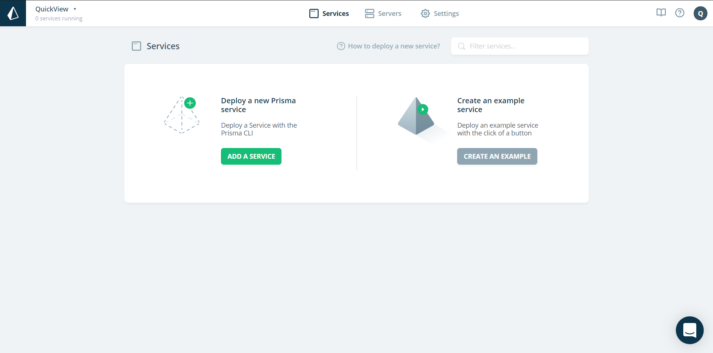

# What is prisma?

> prisma = ORM(Object Relational Mapping 객체 관계 연결)
>
> > prisma 는 데이터베이스 관련 어려운 문제를 해결 해준다.
> >
> > typeorm, django orm, sequelize 같은 다른 orm도 존재한다.

---

prisma는 어플리케이션에 필요한 모데을 **graphql** 로 정의 할 수 있다는 점에서 특별하다

graphql로 정의하면 prisma는 아래 같은 코드로 제공 해 준다

```javascript
// Retrieve all users
const allUsers = await prisma.users()

// Retrieve a single user by email
const bob = await prisma
  .users({ email: "bob@prisma.io" })

// Retrieve all comments of a post in a single request
const commentsOfPost = await prisma
  .post({ id: "cjl4srkaqqxa30b46pqcyzpyo" })
  .comments()
```

*출처 : [prisma 공식 사이트](https://www.prisma.io/)*

----


### prisma 사용해보기

1. [prisma 공식 사이트](https://www.prisma.io/) 에 접속을 한후 로그인 까지 해준다. (git hub로 로그인 가능)
2. 아래 사진 처럼 나오면 ADD A SERVICE 로 들어가준다.




3. 로그인 순서는 처음으로 prisma를 사용하면 파란색의 ```npm install -g prisma``` 로 prisma를 설치해준다.

   


4. 그 다음 터미널에 초록색의 값을 복 붙 하면 로그인이 되면서 아래 사진처럼 나올 것이다.


5. CREATE NEW SERVICE 를 누르면 아래 처럼 나온다. 


터미널에 주황색 부분 ```prisma init hellow-world``` 를 입력한다.


6. 터미널에 입력을하면 아래 사진처럼 나올텐데

   

   

   테스트를 위해 

   1. Demo server + MySql database 를 선택 후에

   2. us 서버

   3. Choose a name for your service(hello-world) ->Enter

   4. Choose a name for your stage(dev) -> Enter

   5. Select the programing language for the generated Prisma client에서는 

      Prisma JavaScript Client를 선택

      

      설치는 이게 끝이다. 

   ----

   

아래 코드는 graphql로 정의하는 예제이다.


*터미널경로는 hello-world 폴더로 경로를 잡아줘야한다*

*아래에서 사용할 ```prisma deploy`` 커맨드는 prisma.yml 파일이 필요하기 때문*


hello-world > 안에 datamodel.prisma 파일이 생겨있을 것이다.

1.  해당 파일에 예제 코드를 작성을한다.

```prisma
type User{ // User 테이블 생성
	// id, name, mail 은 컬럼 명
	
	id:ID! @unique //@unique = pk 
	name: String!
	mail: String!
}
```

2. 그후 터미널에 ```prisma deploy``` 를 입력하면 알아서 갱신후 업데이트 까지 해준다.

3. 이후에도 변경된 점 들이 있다면 ```prisma deploy``` 만 입력을 해주면 된다,

   

Web에서 보면 변경사항을 바로 확인 할 수 있다.

이런식으로 데이터 베이스를 간단하게 관리 할 수있다.


